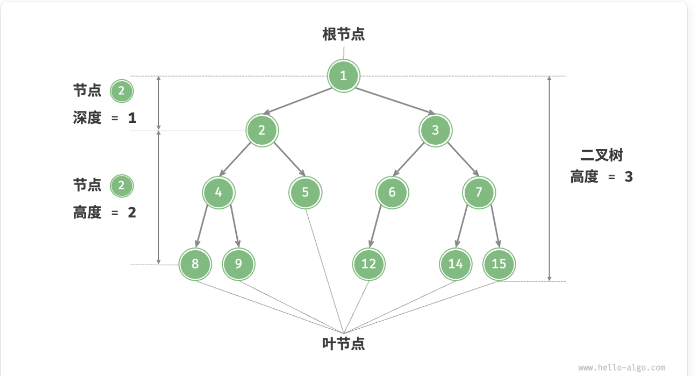
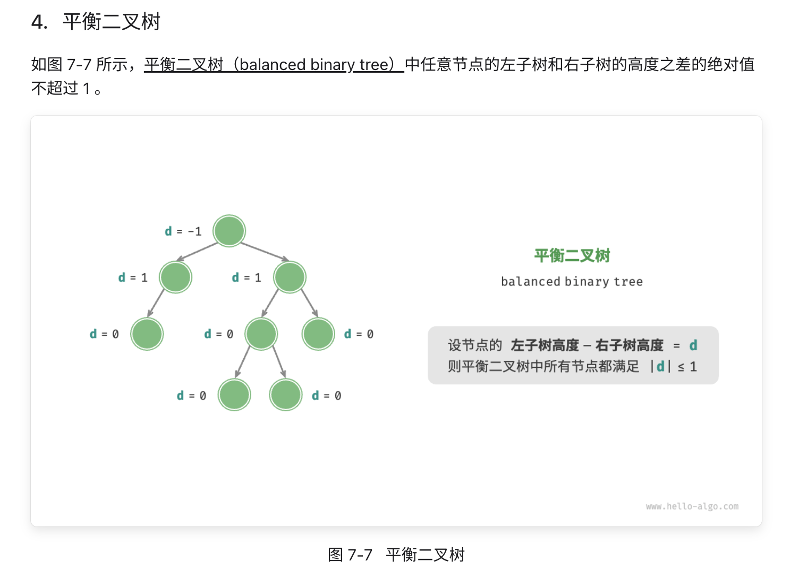

# 树
一种基于链表实现的数据结构，通过索引访问节点实现遍历。
链表是线性的数据结构，可以用索引去简单遍历。
但树是一种非线性数据结构，所以需要遍历算法。
## 遍历算法
有两种维度：广度优先和深度优先

### 广度优先 层序遍历
一层一层往下遍历。

### 深度优先 前序、中序、后序遍历
都是使用递归实现
前序：
根节点 - 左节点 - 右节点

中序：
左节点 - 根节点 - 右节点

后序：
左节点 - 右节点 - 根节点

## 二叉树术语
- 根节点（root node）：位于二叉树顶层的节点，没有父节点。
- 叶节点（leaf node）：没有子节点的节点，其两个指针均指向 None 。
- 边（edge）：连接两个节点的线段，即节点引用（指针）。
- 节点所在的层（level）：从顶至底递增，根节点所在层为 1 。
- 节点的度（degree）：节点的子节点的数量。在二叉树中，度的取值范围是 0、1、2 。
- 二叉树的高度（height）：从根节点到最远叶节点所经过的边的数量。
- 节点的深度（depth）：从根节点到该节点所经过的边的数量。
- 节点的高度（height）：从距离该节点最远的叶节点到该节点所经过的边的数量。
  
边的数量 是量化指标

## 完美二叉树 perfect binary tree
所有层的节点都被填满了，符合细胞分裂现象。

## 完全二叉树 complete binary tree
只有底层叶节点未被填满，且未被填满的叶节点的左节点也是优先被填充（尽量靠左填充）

## 完满二叉树 full binary tree
所有非叶节点都有两个子节点

对树的分类，对树的呈现的概括。
完美： 二叉树的节点都填满了，完美！
完全： 虽然没填满，但是只差一点点，差底层叶节点的右节点没被填满。
完满： 除了叶节点，都填满了！

## 平衡二叉树 balanced binary tree
左节点的树的高度 - 右节点的树的高度 <= 1的绝对值

平衡二叉树通过保持树的高度在合理范围内，确保了高效的查找、插入和删除操作。它是许多应用程序和算法中的重要数据结构，特别是在需要频繁插入和删除的场景中。

